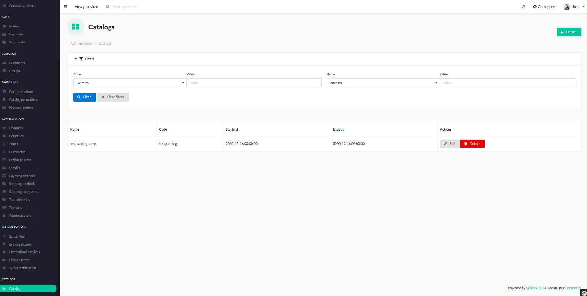
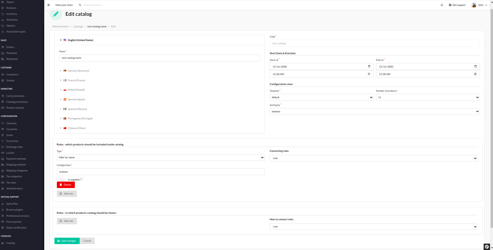

# Functionalities

---

BitBag SyliusCatalogPlugin Allows for displaying catalog with products - calculated dynamically with rules.

Once installed, user has access to the "Catalog" section. 

    

It is possible to create your own catalog through the configuration form. User can configure:

* code
* names, when it should be shown
* when it should be shown - this is useful for time restricted special offers or promotions
* there is set of rules that restrict which products will be shown inside, they can be combined using AND or OR.
* there is another set of rules - used to restrict products associated with given catalog - it can be shown on product details page
* templates for each catalog

    

This is an example catalog on the Homepage for the creation form from the previous screen.

    

